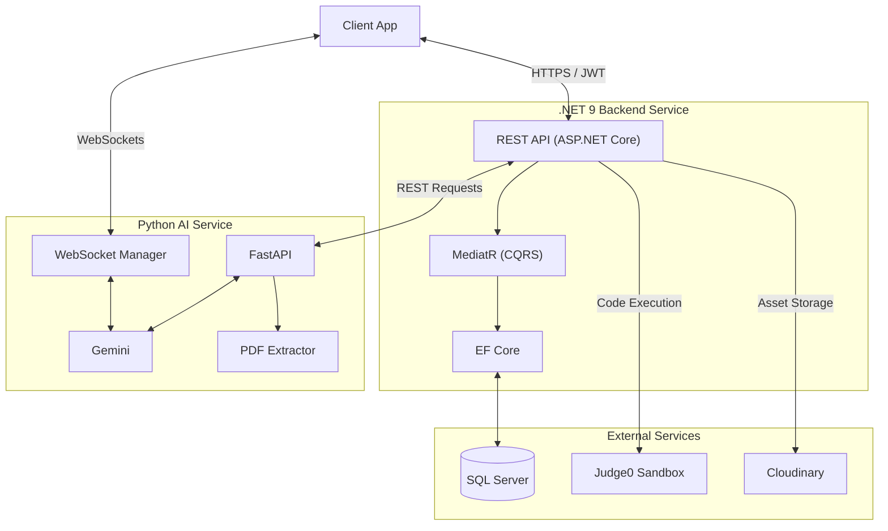
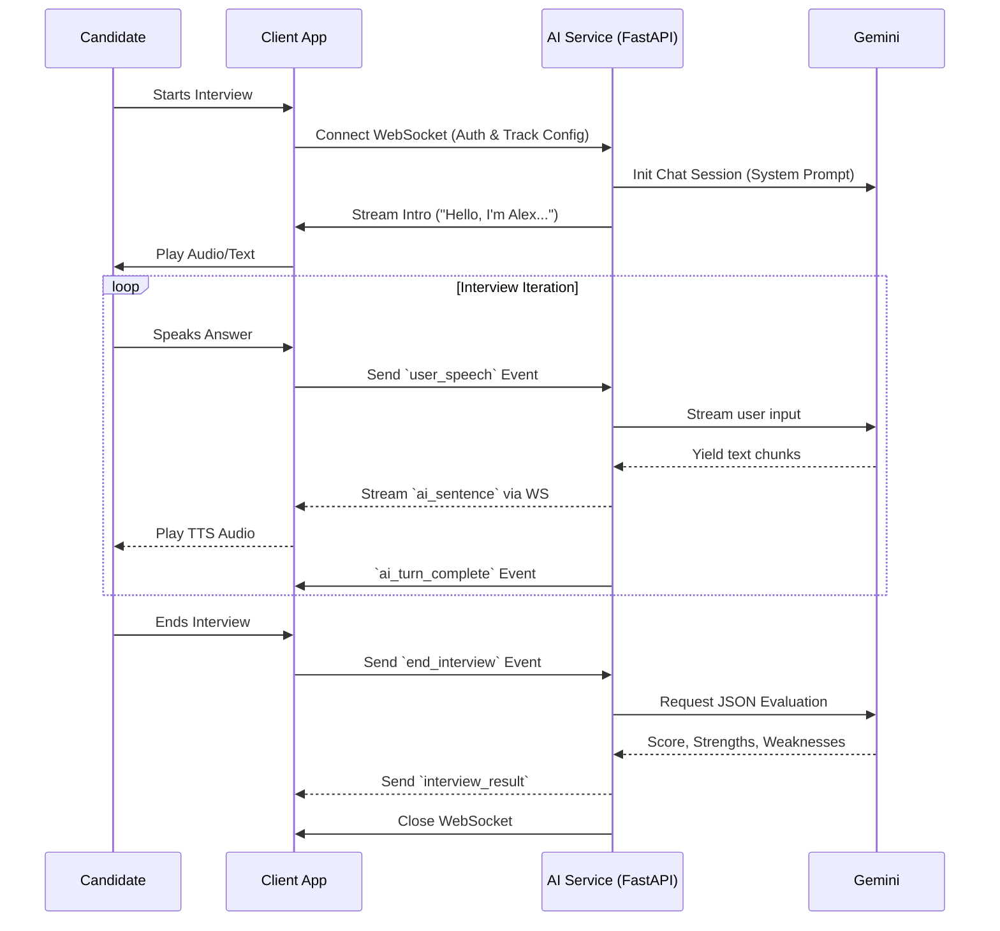

<div align="center">

# MockMate.ai

### *AI-Powered Technical Interview Practice Platform*

*Analyze your CV. Master your skills. Ace your interview.*

[](https://dotnet.microsoft.com/)
[](https://www.python.org/)
[](https://fastapi.tiangolo.com/)

</div>

---

## Overview

**MockMate.ai** is a full-stack, AI-powered platform designed to help software engineers prepare for technical interviews. It analyzes a candidate's uploaded CV and job description to intelligently extract required technical skills, then generates personalized interview sessions. 

The platform supports both **Database-Driven Assessments** (MCQs and Live Coding via Judge0) and cutting-edge **Real-Time AI Voice Interviews** powered by Google Gemini.

> **Graduation Project:** This platform is built as a graduation project utilizing a modern microservices architecture, featuring a .NET 9 Backend and a Python FastAPI AI Service.

---

## Key Features

| Feature | Description |
|---|---|
| **Smart CV & JD Analysis** | Upload a PDF resume and/or job description. Our NLP engine extracts your track, seniority level, and technical skills automatically. |
| **Real-Time AI Voice Interviews** | Experience a "walkie-talkie" style interview with a highly professional AI (Gemini). The AI asks dynamic, advanced technical questions, probes for deep understanding, and evaluates your performance in real time via WebSockets. |
| **Live Code Execution** | Write, execute, and evaluate code against real test cases in a secure remote sandbox powered by **Judge0**. |
| **Targeted Assessments** | Take timed multiple-choice questions matching your specific track and experience level with instant automated grading. |
| **Comprehensive Scoring** | Receive detailed post-interview evaluations, highlighting strengths, weaknesses, and ideal answers to missed questions. |
| **Cloud & Security** | Secure JWT authentication, encrypted data storage in SQL Server, and cloud asset management via Cloudinary. |

---

## Architecture

MockMate.ai is a **microservices ecosystem** built to be highly scalable and robust.

### System Architecture Diagram



### Real-Time Voice Interview Flow

The platform utilizes WebSockets to stream responses back and forth between the candidate and the AI interviewer to ensure a low-latency, conversational experience without breaking character.



---

## Tech Stack

### Backend (.NET Core)
- **Framework**: .NET 9, ASP.NET Core Web API
- **Architecture**: Vertical Slice Architecture, CQRS (MediatR)
- **Data & ORM**: SQL Server, Entity Framework Core 9.0
- **Security**: ASP.NET Core Identity, JWT Bearer Authentication
- **Integrations**: Judge0 API (Code Sandbox), Cloudinary SDK

### AI Service (Python)
- **Framework**: Python 3.12, FastAPI, Uvicorn (ASGI)
- **AI/LLM**: Google Gemini (via `google-genai`)
- **Real-Time**: WebSockets for low-latency streaming
- **PDF Processing**: `pdfplumber`, `pdfminer.six`
- **Validation**: Pydantic v2

---

## Getting Started

### Prerequisites

Ensure the following are installed on your machine:
- [.NET 9 SDK](https://dotnet.microsoft.com/download/dotnet/9.0)
- [Python 3.12+](https://www.python.org/downloads/)
- [SQL Server](https://www.microsoft.com/en-us/sql-server/sql-server-downloads) (Express edition is sufficient for local development)
- [Git](https://git-scm.com/)

---

### Step 1 — Clone the Repository

```bash
git clone https://github.com/your-org/MockMate.ai.git
cd MockMate.ai
```

---

### Step 2 — Backend Setup (.NET API)

Navigate to the API project:
```bash
cd src/Backend/MockMate.Api
```

**Configure your settings:**
Open `appsettings.json` or create a local override file `appsettings.Development.json` and fill in your credentials:

```json
{
  "ConnectionStrings": {
    "DefaultConnection": "Server=.\\SQLEXPRESS; Database=MockMateDb; Trusted_Connection=True; TrustServerCertificate=True"
  },
  "JwtSettings": {
    "Secret": "<a-random-secret-key-at-least-32-characters-long>",
    "Issuer": "MockMate.Auth",
    "Audience": "MockMate.Clients",
    "AccessTokenExpirationMinutes": 60,
    "RefreshTokenExpirationDays": 7
  },
  "Cloudinary": {
    "CloudName": "<your-cloudinary-cloud-name>",
    "ApiKey": "<your-cloudinary-api-key>",
    "ApiSecret": "<your-cloudinary-api-secret>"
  },
  "AiService": {
    "BaseUrl": "http://localhost:8000"
  },
  "Judge0": {
    "BaseUrl": "https://judge029.p.rapidapi.com",
    "ApiKey": "<your-rapidapi-judge0-key>",
    "ApiHost": "judge029.p.rapidapi.com"
  }
}
```

**Restore packages and run:**
```bash
dotnet restore
dotnet run
```

---

### Step 3 — AI Service Setup (Python / FastAPI)

Navigate to the AI service:
```bash
cd src/AI
```

**Create and activate a virtual environment:**
```bash
# Windows (PowerShell)
python -m venv .venv
.venv\Scripts\Activate.ps1

# macOS / Linux
python -m venv .venv
source .venv/bin/activate
```

**Install dependencies:**
```bash
pip install -r requirements.txt
```

**Configure Environment Variables:**
Create a `.env` file in the `src/AI` directory and add your Gemini API key:
```env
GEMINI_API_KEY="your_gemini_api_key_here"
```

**Start the development server:**
```bash
uvicorn main:app --reload --host 0.0.0.0 --port 8000
```

---

### Step 4 — Verify Both Services

Once both services are running, confirm they are healthy:

```bash
# Backend health check
curl http://localhost:5143/health
# Expected output contains: "Healthy"

# AI Service docs
# Open in browser: http://localhost:8000/docs
```

---

<div align="center">
*Built with passion as a graduation project.*

</div>
